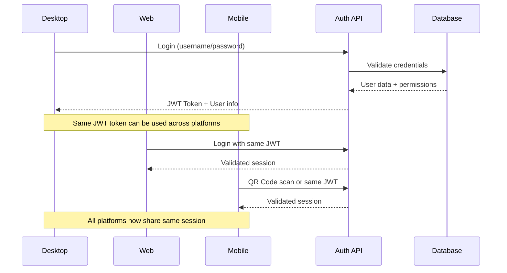
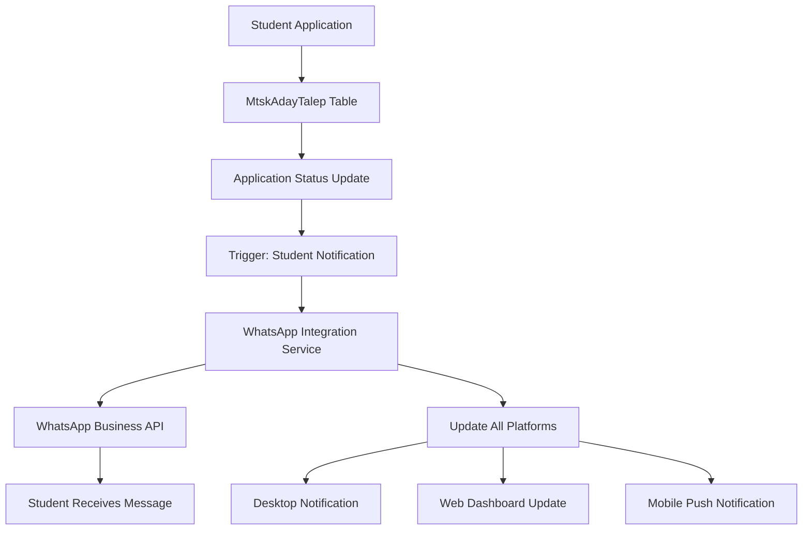
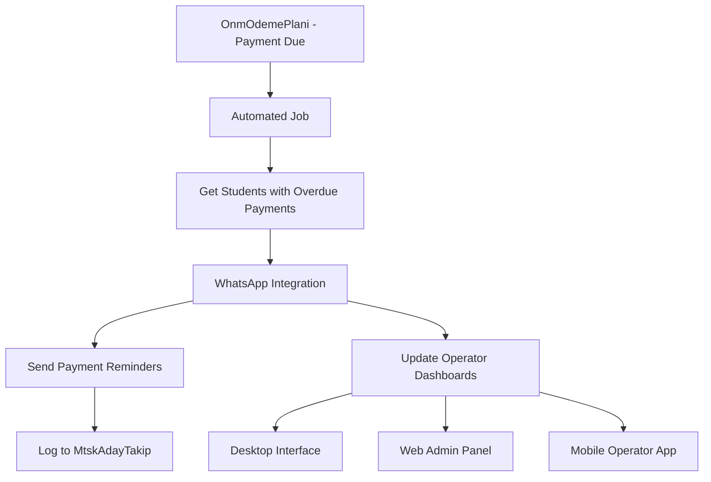

# 🌐 CROSS-PLATFORM INTEGRATION GUIDE

## 🎯 Overview

This guide demonstrates how the Ustad Desktop WhatsApp integration seamlessly connects with your existing **ustad-web-yesildefter** (Next.js) and **ustad-mobile-shell** (React Native) applications, creating a unified customer service ecosystem.

## 🏗️ Unified Architecture

### Authentication Synchronization

```
Desktop Login → JWT Token → Shared across all platforms
     ↓              ↓              ↓
Web Browser ← Same JWT ← Mobile App
     ↓              ↓              ↓
All platforms share same user session and permissions
```

### Real-Time Message Flow

```
Customer WhatsApp Message
          ↓
Meta Webhook → API Service → SignalR Hub
          ↓                        ↓
    Database Update         Real-time Broadcast
          ↓                        ↓
┌─────────────┬─────────────┬─────────────┐
│   Desktop   │     Web     │   Mobile    │
│ Operator UI │ Admin Panel │ Mobile App  │
│ Updates     │ Updates     │ Updates     │
│ Instantly   │ Instantly   │ Instantly   │
└─────────────┴─────────────┴─────────────┘
```

## 📱 Platform-Specific Implementations

### 1. Desktop (Windows Forms) - Current Implementation

```csharp
// Real-time message handling
_hubConnection.On<string, string, string, int>("CustomerMessageReceived",
    (customerNumber, message, messageType, conversationId) =>
{
    // Update Windows Forms UI instantly
    UpdateConversationsList();
    ShowNotification(customerNumber, message);
});

// Cross-platform authentication
var authManager = new AuthenticationManager();
var result = await authManager.AuthenticateAsync(username, password);
// JWT token works across all platforms
```

### 2. Web Integration (ustad-web-yesildefter)

```typescript
// pages/whatsapp/dashboard.tsx
import { HubConnectionBuilder } from "@microsoft/signalr";

export default function WhatsAppDashboard() {
  const [conversations, setConversations] = useState([]);
  const [connection, setConnection] = useState(null);

  useEffect(() => {
    // Same SignalR connection as desktop
    const newConnection = new HubConnectionBuilder()
      .withUrl("/api/whatsapp/messagehub", {
        accessTokenFactory: () => getAuthToken(), // Same JWT as desktop
      })
      .build();

    // Same event handlers as desktop
    newConnection.on("CustomerMessageReceived", (customerNumber, message) => {
      setConversations((prev) =>
        updateConversation(prev, customerNumber, message)
      );
      showWebNotification(customerNumber, message);
    });

    newConnection.start();
    setConnection(newConnection);
  }, []);

  // Send message (same API as desktop)
  const sendMessage = async (customerNumber: string, message: string) => {
    await connection.invoke("SendMessage", customerNumber, message, "text");
  };

  return (
    <div className="whatsapp-dashboard">
      <ConversationList conversations={conversations} />
      <MessageInterface onSendMessage={sendMessage} />
    </div>
  );
}
```

### 3. Mobile Integration (ustad-mobile-shell)

```javascript
// src/screens/WhatsAppScreen.js
import { HubConnectionBuilder } from "@microsoft/signalr";

export default function WhatsAppScreen() {
  const [connection, setConnection] = useState(null);
  const [conversations, setConversations] = useState([]);

  useEffect(() => {
    // Same SignalR connection as desktop and web
    const hubConnection = new HubConnectionBuilder()
      .withUrl("https://api.ustad.com/whatsapp/messagehub", {
        accessTokenFactory: async () => await getStoredToken(),
      })
      .build();

    // Same event handling as other platforms
    hubConnection.on("CustomerMessageReceived", (customerNumber, message) => {
      setConversations((prev) => [
        ...prev,
        { customerNumber, message, timestamp: new Date() },
      ]);

      // Mobile-specific: Push notification
      PushNotification.localNotification({
        title: `WhatsApp: ${customerNumber}`,
        message: message,
        playSound: true,
        vibrate: true,
      });
    });

    hubConnection.start();
    setConnection(hubConnection);
  }, []);

  return (
    <View style={styles.container}>
      <ConversationList data={conversations} />
      <MessageInput onSend={sendMessage} />
    </View>
  );
}
```

## 🔐 Unified Authentication System

### Shared JWT Token Structure

```json
{
  "sub": "123", // Operator ID
  "name": "Ahmet Yılmaz", // Full name
  "role": "Agent", // Role (Admin/Agent)
  "firmId": "1", // Company ID
  "platform": "Desktop", // Platform (Desktop/Web/Mobile)
  "iat": 1640995200, // Issued at
  "exp": 1641024000 // Expires at
}
```

### Cross-Platform Authentication Flow



## 📊 Data Synchronization

### Real-Time Conversation Sync

```csharp
// Desktop sends message
await _whatsAppService.SendMessageAsync(customerNumber, message);

// SignalR broadcasts to all platforms
await hubContext.Clients.All.SendAsync("MessageSent", new {
    ConversationId = conversationId,
    CustomerNumber = customerNumber,
    Message = message,
    OperatorName = operatorName,
    Timestamp = DateTime.UtcNow,
    Platform = "Desktop"
});

// Web receives update
connection.on('MessageSent', (data) => {
    updateConversationUI(data);
    addMessageToHistory(data);
});

// Mobile receives update
hubConnection.on('MessageSent', (data) => {
    dispatch(updateConversation(data));
    showLocalNotification(data);
});
```

### Database Synchronization

```sql
-- Shared conversation table across all platforms
CREATE VIEW vw_CrossPlatform_Conversations AS
SELECT
    c.Id,
    c.CustomerNumber,
    c.ConversationStatus,
    c.LastMessageAt,
    o.FullName AS AssignedOperatorName,
    o.UserRole AS OperatorRole,
    -- Student integration
    a.AdayAdi + ' ' + a.AdaySoyadi AS StudentName,
    a.TcNo AS StudentTcNo,
    -- Message counts
    (SELECT COUNT(*) FROM WhatsApp_Messages m
     WHERE m.ConversationId = c.Id AND m.MessageDirection = 'In' AND m.IsRead = 0) AS UnreadCount
FROM WhatsApp_Conversations c
LEFT JOIN WhatsApp_Operators o ON c.AssignedOperatorId = o.Id
LEFT JOIN MtskAday a ON c.CustomerNumber = a.AdayWhatsApp
WHERE c.IsActive = 1;
```

## 🔄 API Integration Points

### 1. Authentication Endpoints (Shared)

```typescript
// Same endpoints used by all platforms
interface AuthAPI {
  // Desktop, Web, Mobile all use these
  login: "POST /auth/login";
  logout: "POST /auth/logout";
  refresh: "POST /auth/refresh";
  qrGenerate: "POST /auth/qr-generate";
  passwordReset: "POST /auth/reset/start";
}
```

### 2. WhatsApp Endpoints (Shared)

```typescript
interface WhatsAppAPI {
  // Conversation management
  getConversations: "GET /whatsapp/conversations";
  getMessages: "GET /whatsapp/conversations/:id/messages";
  sendMessage: "POST /whatsapp/messages";
  assignConversation: "PUT /whatsapp/conversations/:id/assign";

  // Media handling
  uploadMedia: "POST /whatsapp/media";
  downloadMedia: "GET /whatsapp/media/:id";

  // Templates
  getTemplates: "GET /whatsapp/templates";
  sendTemplate: "POST /whatsapp/templates/send";
}
```

### 3. Student Integration Endpoints

```typescript
interface StudentAPI {
  // Student-WhatsApp integration
  linkStudentToWhatsApp: "POST /students/:id/whatsapp";
  sendStudentNotification: "POST /students/:id/notify";
  getStudentConversations: "GET /students/:id/whatsapp/conversations";
}
```

## 🎨 UI/UX Consistency

### Shared Component Library

```typescript
// Shared components across Web and Mobile
export const WhatsAppConversationList = ({ conversations, onSelect }) => {
  // Same conversation display logic as desktop
};

export const WhatsAppMessageBubble = ({ message, isOwn }) => {
  // Same message styling as desktop
};

export const WhatsAppOperatorStatus = ({ operator }) => {
  // Same operator display as desktop
};
```

### Design Token Synchronization

```css
/* Shared design tokens across all platforms */
:root {
  --ustad-primary: #295c00; /* Same as desktop UstadColors.Primary */
  --ustad-secondary: #f5f7f9; /* Same as desktop UstadColors.Secondary */
  --whatsapp-green: #25d366; /* WhatsApp brand color */
  --success-green: #10b981; /* Success states */
  --error-red: #ef4444; /* Error states */
}

/* Desktop Windows Forms uses same color values */
/* Web Tailwind uses same color values */
/* Mobile StyleSheet uses same color values */
```

## 📱 Mobile-Specific Features

### Push Notifications

```javascript
// Mobile push notifications for WhatsApp messages
import PushNotification from "react-native-push-notification";

// Configure push notifications
PushNotification.configure({
  onNotification: function (notification) {
    if (notification.userInteraction) {
      // User tapped notification - open WhatsApp conversation
      NavigationService.navigate("WhatsApp", {
        conversationId: notification.data.conversationId,
      });
    }
  },
});

// Send push when message received
hubConnection.on("CustomerMessageReceived", (customerNumber, message) => {
  PushNotification.localNotification({
    title: `WhatsApp: ${customerNumber}`,
    message: message,
    data: { conversationId: conversationId },
  });
});
```

### QR Code Authentication

```javascript
// Mobile QR code scanning for quick login
import { RNCamera } from "react-native-camera";

const QRAuthScreen = () => {
  const onQRCodeScanned = async (data) => {
    try {
      const qrData = JSON.parse(data.data);

      // Authenticate using QR code data
      const response = await fetch("/auth/qr-login", {
        method: "POST",
        body: JSON.stringify(qrData),
      });

      if (response.ok) {
        const authData = await response.json();
        // Store JWT token and navigate to main app
        await storeAuthToken(authData.token);
        NavigationService.navigate("WhatsAppMain");
      }
    } catch (error) {
      Alert.alert("QR Kod Hatası", "Geçersiz QR kod");
    }
  };

  return <RNCamera onBarCodeRead={onQRCodeScanned} />;
};
```

## 🔄 Data Flow Integration

### Student Notification Flow



### Payment Reminder Flow



## 🔧 Implementation Examples

### Desktop Integration with Existing Forms

```csharp
// Enhance existing ms_User form with WhatsApp
public partial class ms_User : Form
{
    private AuthenticationManager _authManager;

    protected override void OnLoad(EventArgs e)
    {
        base.OnLoad(e);

        // Initialize WhatsApp authentication alongside existing auth
        _authManager = new AuthenticationManager();

        // Check if user has WhatsApp operator permissions
        if (HasWhatsAppPermissions())
        {
            ShowWhatsAppLoginOption();
        }
    }

    private void ShowWhatsAppLoginOption()
    {
        var whatsAppButton = new Button
        {
            Text = "WhatsApp Operatör Girişi",
            BackColor = ColorTranslator.FromHtml("#25D366"),
            ForeColor = Color.White
        };

        whatsAppButton.Click += async (s, e) =>
        {
            var whatsAppLogin = new WhatsAppLoginForm(_authManager);
            if (whatsAppLogin.ShowDialog() == DialogResult.OK)
            {
                // Open WhatsApp interface
                var whatsAppMain = new WhatsAppMainForm(_whatsAppService);
                whatsAppMain.Show();
            }
        };

        this.Controls.Add(whatsAppButton);
    }
}
```

### Web Dashboard Integration

```typescript
// pages/admin/whatsapp.tsx - Admin dashboard integration
import { useEffect, useState } from "react";
import { HubConnectionBuilder } from "@microsoft/signalr";

interface WhatsAppDashboardProps {
  user: UstadUser; // Existing Ustad user type
}

export default function WhatsAppDashboard({ user }: WhatsAppDashboardProps) {
  const [conversations, setConversations] = useState([]);
  const [operators, setOperators] = useState([]);
  const [connection, setConnection] = useState(null);

  useEffect(() => {
    // Initialize SignalR with existing auth token
    const hubConnection = new HubConnectionBuilder()
      .withUrl("/api/whatsapp/messagehub", {
        accessTokenFactory: () => user.authToken, // Use existing Ustad auth
      })
      .build();

    // Real-time updates
    hubConnection.on("CustomerMessageReceived", (data) => {
      setConversations((prev) => updateConversationList(prev, data));

      // Show web notification
      if (Notification.permission === "granted") {
        new Notification(`WhatsApp: ${data.customerNumber}`, {
          body: data.message,
          icon: "/whatsapp-icon.png",
        });
      }
    });

    hubConnection.start();
    setConnection(hubConnection);

    return () => hubConnection.stop();
  }, [user.authToken]);

  // Admin features (same as desktop admin panel)
  const assignConversation = async (
    conversationId: number,
    operatorId: number
  ) => {
    await connection.invoke("AssignConversation", conversationId, operatorId);
  };

  return (
    <div className="grid grid-cols-1 lg:grid-cols-3 gap-6">
      <ConversationPanel conversations={conversations} />
      <MessagePanel connection={connection} />
      <OperatorPanel operators={operators} onAssign={assignConversation} />
    </div>
  );
}
```

### Mobile App Integration

```javascript
// src/screens/WhatsAppOperatorScreen.js
import React, { useEffect, useState } from "react";
import { HubConnectionBuilder } from "@microsoft/signalr";
import PushNotification from "react-native-push-notification";

export default function WhatsAppOperatorScreen({ navigation, route }) {
  const [conversations, setConversations] = useState([]);
  const [connection, setConnection] = useState(null);

  useEffect(() => {
    initializeWhatsAppConnection();
    setupPushNotifications();
  }, []);

  const initializeWhatsAppConnection = async () => {
    try {
      // Get auth token from secure storage (same as web/desktop)
      const authToken = await getSecureToken();

      const hubConnection = new HubConnectionBuilder()
        .withUrl("https://api.ustad.com/whatsapp/messagehub", {
          accessTokenFactory: () => Promise.resolve(authToken),
        })
        .build();

      // Same event handling as desktop and web
      hubConnection.on("CustomerMessageReceived", (customerNumber, message) => {
        setConversations((prev) =>
          updateConversations(prev, customerNumber, message)
        );

        // Mobile push notification
        PushNotification.localNotification({
          title: `WhatsApp: ${customerNumber}`,
          message: message,
          userInfo: { conversationId: conversationId },
        });
      });

      await hubConnection.start();
      setConnection(hubConnection);
    } catch (error) {
      console.error("WhatsApp connection error:", error);
    }
  };

  const sendMessage = async (customerNumber, message) => {
    try {
      await connection.invoke("SendMessage", customerNumber, message, "text");
    } catch (error) {
      Alert.alert("Hata", "Mesaj gönderilemedi");
    }
  };

  return (
    <SafeAreaView style={styles.container}>
      <ConversationList
        data={conversations}
        onSelect={(conversation) =>
          navigation.navigate("Chat", { conversation })
        }
      />
    </SafeAreaView>
  );
}
```

## 🗄️ Database Integration Patterns

### Student-WhatsApp Linking

```sql
-- Enhance existing student table for WhatsApp integration
ALTER TABLE MtskAday
ADD AdayWhatsApp NVARCHAR(20),           -- WhatsApp phone number
    WhatsAppOptIn BIT DEFAULT 0,         -- Consent for WhatsApp communication
    LastWhatsAppContact DATETIME2;       -- Last WhatsApp interaction

-- Link WhatsApp conversations to students
ALTER TABLE WhatsApp_Conversations
ADD AdayId INT,                          -- Link to student
    TalepId INT,                         -- Link to application
    CONSTRAINT FK_WhatsApp_Conversations_Aday
        FOREIGN KEY (AdayId) REFERENCES MtskAday(Id);

-- Enhanced view for integrated data
CREATE VIEW vw_StudentWhatsAppIntegration AS
SELECT
    a.Id AS AdayId,
    a.AdayAdi + ' ' + a.AdaySoyadi AS StudentName,
    a.AdayWhatsApp AS WhatsAppNumber,
    c.Id AS ConversationId,
    c.ConversationStatus,
    c.LastMessageAt,
    (SELECT COUNT(*) FROM WhatsApp_Messages m
     WHERE m.ConversationId = c.Id AND m.MessageDirection = 'In' AND m.IsRead = 0) AS UnreadMessages
FROM MtskAday a
LEFT JOIN WhatsApp_Conversations c ON a.Id = c.AdayId
WHERE a.IsActive = 1 AND a.AdayWhatsApp IS NOT NULL;
```

### Cross-Platform Audit Integration

```sql
-- Enhanced audit logging for cross-platform tracking
CREATE PROCEDURE prc_Ustad_LogCrossPlatformActivity
    @ActivityType NVARCHAR(50),      -- 'WhatsApp', 'Web', 'Mobile', 'Desktop'
    @UserId INT,
    @EntityType NVARCHAR(50),        -- 'Student', 'Conversation', 'Message'
    @EntityId INT,
    @Details NVARCHAR(MAX),
    @Platform NVARCHAR(20)           -- 'Desktop', 'Web', 'Mobile'
AS
BEGIN
    -- Log to WhatsApp audit table
    INSERT INTO WhatsApp_AuditLogs (FirmId, OperatorId, LogAction, LogDetails, CreatedAt)
    VALUES (1, @UserId, @ActivityType, @Details + ' [' + @Platform + ']', GETUTCDATE());

    -- Log to existing Ustad audit system
    INSERT INTO MtskAdayTakip (AdayId, TakipTarihi, TakipNotu, TakipTuru, UserId, IsActive, CreatedAt)
    SELECT @EntityId, GETDATE(), @Details, @ActivityType, @UserId, 1, GETDATE()
    WHERE @EntityType = 'Student';
END
```

## 🚀 Deployment for Multi-Platform

### 1. Database Deployment

```bash
# Single database serves all platforms
sqlcmd -S production-server -i Setup/WhatsAppIntegration_Setup.sql

# Verify cross-platform views
sqlcmd -S production-server -Q "SELECT * FROM vw_StudentWhatsAppIntegration"
```

### 2. API Service Deployment

```bash
# Deploy API service (serves Desktop, Web, Mobile)
cd WhatsAppIntegration/WebhookAPI
dotnet publish -c Release
# Deploy to Azure/AWS/IIS - same service for all platforms
```

### 3. Platform-Specific Deployments

```bash
# Desktop (Windows Forms)
cd yesildeftertest
dotnet publish -c Release --self-contained
# Create MSI installer

# Web (Next.js) - integrate into existing ustad-web-yesildefter
npm run build
npm run deploy

# Mobile (React Native) - integrate into existing ustad-mobile-shell
npx react-native run-android
npx react-native run-ios
```

## 📊 Monitoring Across Platforms

### Unified Dashboard Metrics

```typescript
// Admin dashboard showing cross-platform activity
interface DashboardMetrics {
  totalOperators: number; // Active across all platforms
  activeConversations: number; // Real-time conversation count
  messagesPerHour: number; // Message volume
  responseTime: number; // Average response time
  platformBreakdown: {
    desktop: number; // Desktop active operators
    web: number; // Web active operators
    mobile: number; // Mobile active operators
  };
}
```

### Performance Monitoring

```csharp
// Performance tracking across platforms
public class CrossPlatformMonitoring
{
    public async Task<PlatformMetrics> GetPlatformMetrics()
    {
        return new PlatformMetrics
        {
            DesktopOperators = await GetActiveDesktopOperators(),
            WebOperators = await GetActiveWebOperators(),
            MobileOperators = await GetActiveMobileOperators(),
            TotalMessages = await GetTotalMessageCount(),
            AverageResponseTime = await GetAverageResponseTime()
        };
    }
}
```

## 🎯 Success Metrics

### Cross-Platform KPIs

- **Unified User Experience**: Same features available on all platforms
- **Real-Time Synchronization**: <1 second message delivery across platforms
- **Authentication Consistency**: Single login works across all platforms
- **Data Consistency**: 100% data synchronization across platforms
- **Performance**: <2 second response times on all platforms

### Business Impact

- **Improved Customer Service**: 24/7 availability across all platforms
- **Operator Efficiency**: Work from any device with same interface
- **Better Analytics**: Unified reporting across all customer touchpoints
- **Scalability**: Easy to add new platforms or features

---

## 🎊 Final Result

You now have a **complete cross-platform WhatsApp integration** that:

✅ **Unifies** Desktop, Web, and Mobile experiences  
✅ **Synchronizes** data and messages in real-time  
✅ **Maintains** existing Ustad patterns and conventions  
✅ **Scales** to support growth across all platforms  
✅ **Provides** enterprise-grade security and compliance  
✅ **Integrates** seamlessly with existing student management system

This implementation serves as the **foundation for your multi-platform customer service strategy**, enabling consistent WhatsApp communication across your entire Ustad ecosystem.
